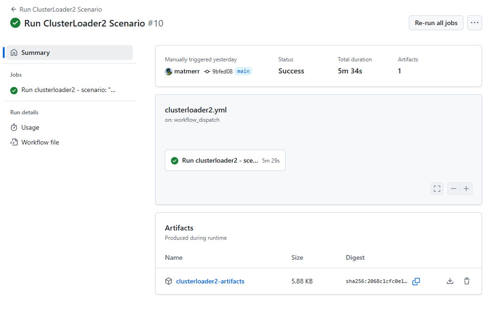

# scaletest

## Overview

This project automates the deployment and benchmarking of Kubernetes clusters using modular providers (kind, Azure), scenario-driven test logic, and matrix-based CI workflows. It is designed for robust, repeatable, and CI-friendly performance testing and metrics collection.

## Project Layout

- `.github/workflows/`: All CI/CD workflows, including matrix-based workflows for executors (kube-burner, clusterloader2). Main entry points for CI are here.
- `pkg/infrastructure/providers/`: Provider abstractions and implementations (kind, Azure, etc.), including provider registry and workflow logic for cluster provisioning. Provider selection is now registry-driven and error-checked.
- `pkg/executors/`: Executors for running specific test tools (e.g., kube-burner, clusterloader2) in a provider-agnostic way. Executors are modular and accept scenario structs from the scenario registry.
- `scenarios/`: Scenario definitions and scenario-specific assets for each test type (e.g., `scenarios/kube-burner/`, `scenarios/clusterloader2/`). Scenarios are registered in a struct-based registry and selected via environment variable.
- `Makefile`: Build, test, and utility targets for local development and CI.
- `.gitignore`: Ignores all `output/` directories under scenarios and other generated files.


## Usage: Running in CI

The scenario and provider can be selected via GitHub Actions inputs. The workflows are designed to run matrix-based tests across different scenarios and providers.

- Queue the scenario and cluster provider you want to test in the GitHub Actions UI. For example, you can select `uniformqps` scenario with `kindwithcilium` provider.


- Scenario results are attached to the run as artifacts.



## Usage: Running Locally

You can run any scenario with any provider locally using environment variables and Makefile targets. Here are some common permutations:

### Prerequisites
- Go 1.20+
- GNU Make
- Docker (for kind clusters)
- Azure CLI (for Azure provider, if used)

### ClusterLoader2

Run the `uniformqps` scenario on a kind cluster with Cilium:
```sh
export CLUSTER_PROVIDER=kindwithcilium
export CL2_SCENARIO=uniformqps
make test-cl2
```


### Kube-Burner

Run the `netpolchurn` scenario on a kind cluster with Cilium:
```sh
export CLUSTER_PROVIDER=kindwithcilium
export KB_SCENARIO=netpolchurn
make test-kb
```

Run the `apiintensive` scenario on an existing AKS cluster:
```sh
export CLUSTER_PROVIDER=aksexistingcluster
export KB_SCENARIO=apiintensive
make test-kb
```

> **Tip:** You can list available providers and scenarios by checking the dropdowns in the GitHub Actions workflows or by reviewing the scenario/provider registries in the code.


--- 
## Developer Environment

### Downloading Tools
To download required binaries (kind, kube-burner, etc.):

```sh
make tools
```

### Generating Scenario YAMLs
To generate scenario YAML files for all registered scenarios:

```sh
make generate
```

### Running Tests and Workflows

- Scenario and provider selection is now handled via environment variables (`KB_SCENARIO`, `CL2_SCENARIO`, `CLUSTER_PROVIDER`) and validated against the scenario/provider registries. If an invalid value is provided, available options are logged and the test fails early.


## Creating a New Scenario

To add a new scenario for either ClusterLoader2 or Kube-Burner, follow these steps:

### 1. Generate a New Scenario with Copilot Agent

> **Tip:** Make sure Copilot is set to `Agent` mode (Ctrl + Shift + I), not `Ask` mode

**Prompt for ClusterLoader2:**
```
Create a new scenario for clusterloader2 under the scenarios/clusterloader2 directory. The scenario should be named <yourscenarioname>, include a Go config definition, a parameterized YAML template which represents the CL2 config, and register it in the scenario registry. Follow the pattern the other scenarios use, and assigning scenario values within the clusterloader2 config at generation time with go template mechanism. Make sure the scenario is selectable via the CL2_SCENARIO environment variable and is compatible with the current struct-based registry pattern. Add the new scenario name to the respective github actions dropdown.
```

**Prompt for Kube-Burner:**
```
Create a new scenario for kube-burner under the scenarios/kube-burner directory. The scenario should be named <yourscenarioname>, include a Go config definition, a parameterized YAML template which represents the KB config, and register it in the scenario registry. Follow the pattern the other scenarios use, and assigning scenario values within the kube-burner config at generation time with go template mechanism. Make sure the scenario is selectable via the KB_SCENARIO environment variable and is compatible with the current struct-based registry pattern. Add the new scenario name to the respective github actions dropdown.
```

**Example Copilot results:**


### 2. Register the Scenario
- Add your new scenario to the appropriate scenario registry file (e.g., `scenarios/clusterloader2/scenarios_registry.go` or `scenarios/kube-burner/scenarios.go`).
- Ensure the scenario name matches what you want to use in environment variables and CI dropdowns.

### 3. Add to GitHub Actions
- Edit the relevant workflow file in `.github/workflows/` (e.g., `clusterloader2.yml` or `kube-burner.yml`).
- Add your new scenario name to the `options:` list for the appropriate input (e.g., `CL2_SCENARIO` or `KB_SCENARIO`).
- This will make your scenario available as a dropdown option in the GitHub Actions UI.

### 4. Generate YAML and Test
- Run `make generate` to create the scenario YAML files.
- Test your scenario locally and in CI to ensure it works as expected.

---

For more details, see the `README.md` files in each subdirectory.
